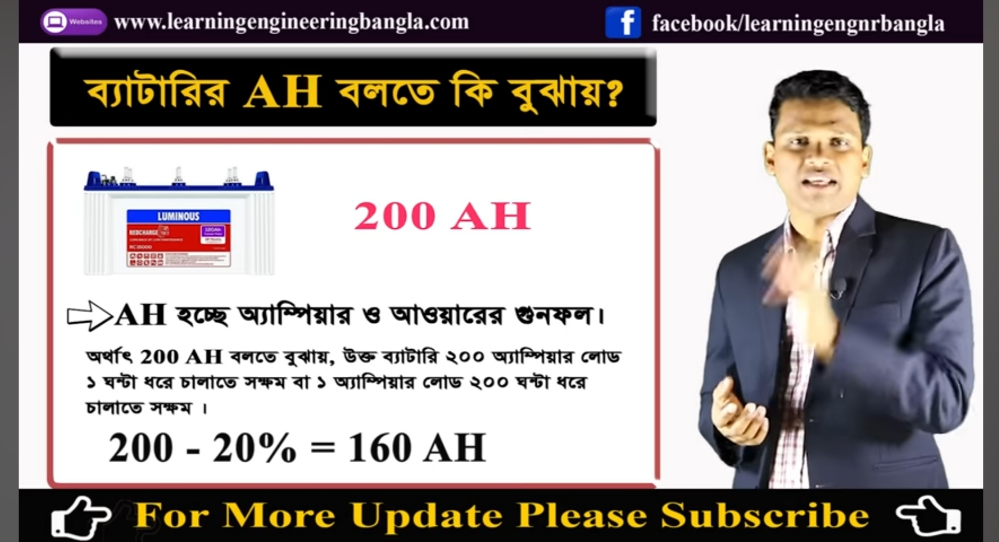
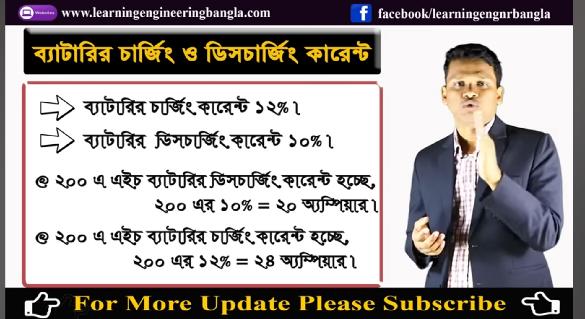

## ips/soler ব্যাটারি ব্যাবহার করার নিয়ম! 

<!--[profile](./r.jpg)-->

(১) মোট ব্যাটারি Amp থেকে ২০% বাদ দিয়ে Amp দরতে হবে
 
 যেমন:-200Amp*20%=160 Amp ব্যাবহার করা যাবে। 

## ব্যাটারি চার্জ এবং ডিসচার্জ করার নিয়ম।

<!--[profile](./r2.jpg)-->

(১) ব্যাটারি ডিসচার্জ ১০%

(২) ব্যাটারি চার্জ ১২% 

